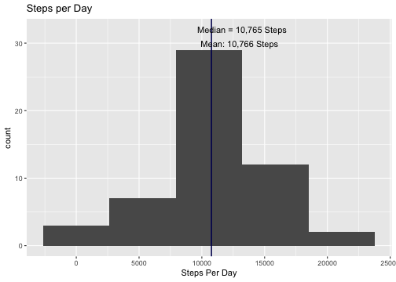
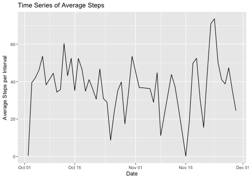
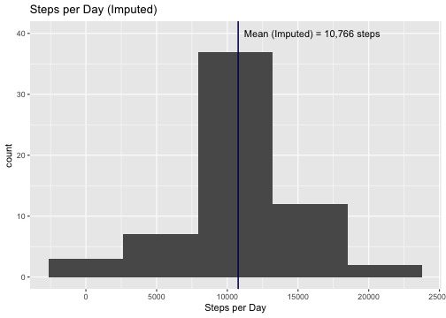
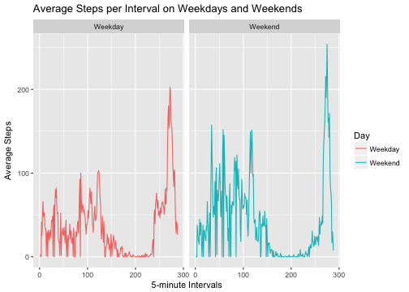

##Setup R, load appropriate libraries


##Load Data into R

```r
url = "https://d396qusza40orc.cloudfront.net/repdata%2Fdata%2Factivity.zip"
download.file(url, destfile = "act.zip", method = "curl") # download file
unzip("act.zip", exdir = "activity.csv") # unzip files
file.remove("act.zip") # tidy up by removing the zip file
```

```
## [1] TRUE
```

```r
df <- read.csv("./data/activity.csv", stringsAsFactors = FALSE, header = TRUE, 
               colClasses = c("numeric", "Date", "factor"))
```

##Exploration of Data

```r
##Briefly view the data
summary(df)
```

```
##      steps             date               interval    
##  Min.   :  0.00   Min.   :2012-10-01   0      :   61  
##  1st Qu.:  0.00   1st Qu.:2012-10-16   10     :   61  
##  Median :  0.00   Median :2012-10-31   100    :   61  
##  Mean   : 37.38   Mean   :2012-10-31   1000   :   61  
##  3rd Qu.: 12.00   3rd Qu.:2012-11-15   1005   :   61  
##  Max.   :806.00   Max.   :2012-11-30   1010   :   61  
##  NA's   :2304                          (Other):17202
```

```r
str(df)
```

```
## 'data.frame':	17568 obs. of  3 variables:
##  $ steps   : num  NA NA NA NA NA NA NA NA NA NA ...
##  $ date    : Date, format: "2012-10-01" "2012-10-01" ...
##  $ interval: Factor w/ 288 levels "0","10","100",..: 1 226 2 73 136 195 198 209 212 223 ...
```

##Data processing and analysis


###Determine the total, mean, and median number of steps taken each day

```r
tsteps <- aggregate(steps ~ date, data = df, FUN = sum, na.rm = TRUE)
meansteps <- mean(tsteps$steps)
mediansteps <- median(tsteps$steps)
print(meansteps)
```

```
## [1] 10766.19
```

```r
print(mediansteps)
```

```
## [1] 10765
```

###Determine the average steps per interval each day for the time-series plot

```r
timeseries <- aggregate(steps~date,data=df,FUN=mean,na.rm=TRUE)
```


###Calculate the interval that, on average, contains the most steps

```r
interval <- aggregate(steps~interval, data = df, FUN = mean, na.rm = TRUE)
interval[which.max(interval$steps),]
```

```
##     interval    steps
## 272      835 206.1698
```

###Impute missing values:
###Strategy: Estimate missing values based on average value of each interval

```r
notna <- filter(df, !is.na(steps)) #create df excluding the NA's
na <- filter(df, is.na(steps)) #Check where the NA's are located
table(na$date) #So the NAs occur on 8 days where all the data is missing that day
```

```
## 
## 2012-10-01 2012-10-08 2012-11-01 2012-11-04 2012-11-09 2012-11-10 
##        288        288        288        288        288        288 
## 2012-11-14 2012-11-30 
##        288        288
```

```r
##Recall that interval contains average steps by each interval excluding NA's
interval <- arrange(interval, as.numeric(as.character(interval))) #Order interval
na$steps <- interval$steps #NA's will be imputed with average for each interval
imputed <- rbind(na, notna) #Combine the filtered dataframes
##Calculate the new mean steps with the imputed values.
tstepsimputed <- aggregate(steps~date, data = imputed, FUN = sum, na.rm = FALSE)
meantstepsimputed <- mean(tstepsimputed$steps)
```

###Calculate mean steps per interval separated by weekends and weekdays

```r
##Add new column specifying weekday and rename to Weekend or Weekday
days <- mutate(imputed, Day = wday(date))
days$Day <- plyr::mapvalues(days$Day, from = c(1, 2, 3, 4, 5, 6, 7), 
                to = c("Weekday", "Weekday", "Weekday", "Weekday", "Weekday", 
                       "Weekend", "Weekend"))
##Calculate means for each interval
int <- aggregate(steps~interval+Day, data = days, FUN = mean, drop = FALSE, 
          simplify = FALSE)
inta <- arrange(int, as.numeric(as.character(interval))) ##Order the dataframe
inta$steps <- unlist(inta$steps) ##Unlist steps so that it is class numeric
```

##Plotting histogram of steps with mean, median included:

```r
ggplot(data = tsteps, aes(x = steps)) + geom_histogram(bins = 5) + labs(x = "Steps Per Day")+ 
        ggtitle("Steps per Day") + geom_vline(xintercept = meansteps, color = "blue") + 
        geom_vline(xintercept = mediansteps) + 
        annotate("text", label = "Mean: 10,766 Steps", x = 13000, y = 30) + 
        annotate("text", label = "Median = 10,765 Steps", x = 13200, y = 32)
```



```r
##Plot Time Series of Average steps
ggplot(data = timeseries, aes(x = date, y = steps)) + geom_line() + labs(x = "Date",
        y = "Average Steps per Interval", title = "Time Series of Average Steps")
```



```r
 ##Histogram of the total number of steps each day after NA's were imputed
ggplot(data = tstepsimputed, aes(x = steps)) + geom_histogram(bins = 5) + labs(x="Steps per Day") +
        ggtitle("Steps per Day (Imputed)") + geom_vline(xintercept = meansteps, color = "blue") + 
        geom_vline(xintercept = meantstepsimputed) + 
                annotate("text", label = "Mean (Imputed) = 10,766 steps", x = 16000, y = 40)
```



```r
##Panel plot comparing average steps taken per 5-minute interval
qplot(data = inta, x = as.numeric(interval), y = steps, facets = .~Day, 
      geom = 'line', fill = Day, color = Day, xlab = "5-minute Intervals", 
      ylab = "Average Steps", main = "Average Steps per Interval on Weekdays and Weekends")
```



